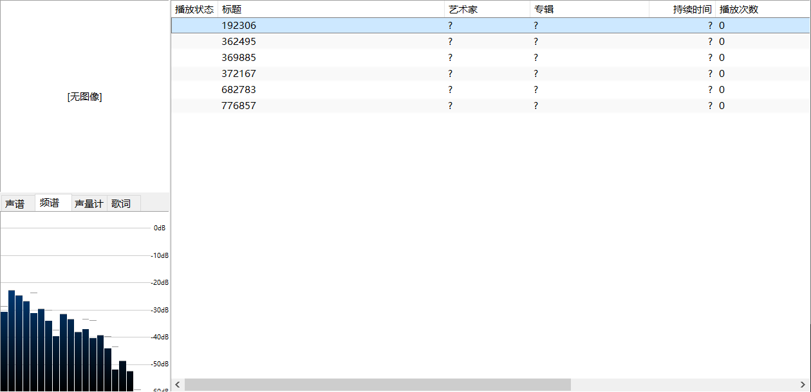

# bili_music_tagger

A auto tagger for Bilibili music.

[中文 README](README_zh.md)




## Usage

```text
Usage: bili-music-tagger [OPTIONS] SOURCE [OUTPUT_DIR]

  A auto tagger for Bilibili music.

  SOURCE is a path to source directory or file.

  OUTPUT_DIR is output directory, [default: ./output]

Options:
  -t, --temp-dir PATH  temp directory, where some cache will put in.
                       [default: (./temp)]
  --overwrite          overwrite file if file exists.
  --version            Show the version and exit.
  --help               Show this message and exit.
```

You can find more details in [Chinese README](README_zh.md).

## License

MIT License
