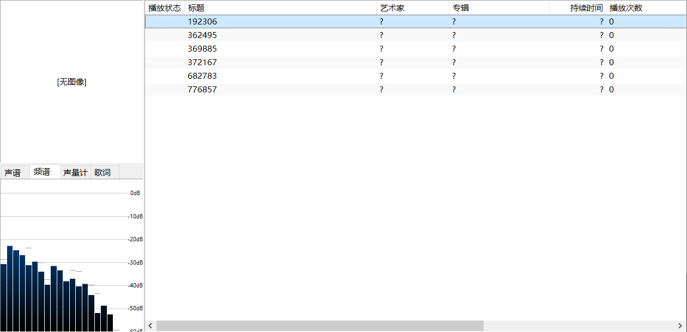
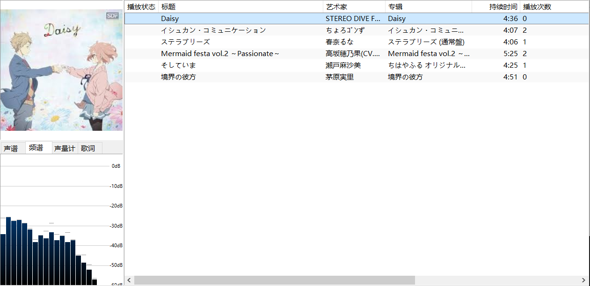
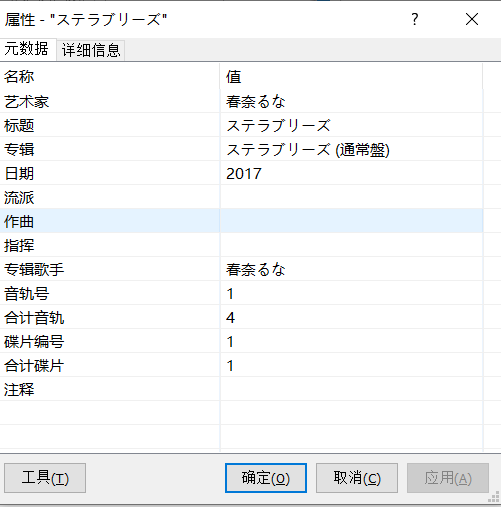

# bili_music_tagger

一个能自动将 Bilibili 音频上缓存的音乐自动添加 tag 信息的小脚本。





## 动机

Bilibili 音频缓存的文件（以 android 为例）在 `/sdcard/android/data/tv.danmaku.bili/files/audio_music` 里。里面文件为 AU ID 命名的文件。实际上这是使用 `mp4` 封装的 `aac` 音乐，可以直接添加后缀 `m4a` ，即可在大多数播放器播放。

然而这些文件并没有像网易云音乐一样自动帮我们添加好标签和封面。这个脚本能自动从 Bilibili 上获取歌曲信息，自动填写歌曲 tag 。



目前支持以上已填写的 tag ，以及专辑封面。

## 使用方法

### 准备

[下载源码](https://github.com/wlkz/bili_music_tagger/archive/master.zip)（或者 `git clone` ）。

#### 安装（推荐）

```sh
pip install -e .
```

安装即可。该方法会自动安装依赖。

#### 直接运行（不推荐）

适合高手。

请自行安装一下依赖。

```text
requests
click
mutagen
```

下文中，请使用命令 `python bili_music_tagger.py` 代替 `bili-music-tagger`。

### 快速开始

```text
Usage: bili-music-tagger [OPTIONS] SOURCE [OUTPUT_DIR]

  SOURCE 是待转换文件或者目录的路径.

  OUTPUT_DIR 是输出路径, [默认: ./output]

Options:
  -t, --temp-dir PATH  临时目录，存放各种缓存。
  --version            显示版本号。
  --help               显示帮助。
```

大多数情况下，可以新建一个目录，以 `./source` 为例。将待转换文件全部放进去。运行一下命令即可。

```sh
bili-music-tagger ./source
```

输出默认将在 `./output` 下。

## 感谢

[@haozi23333](https://github.com/haozi23333) 提供的 Bilibili 音频的 API。原文：[https://haozi.moe/2019/11/02/bilibili-audio-api/](https://haozi.moe/2019/11/02/bilibili-audio-api/)
